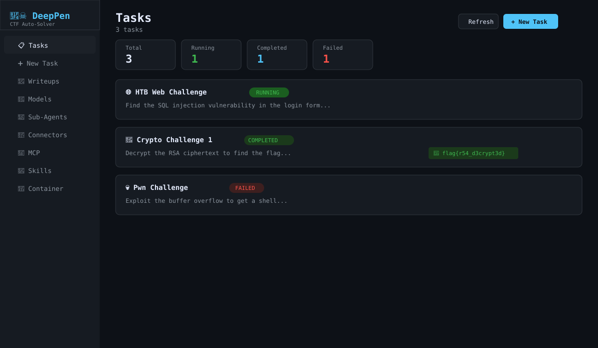
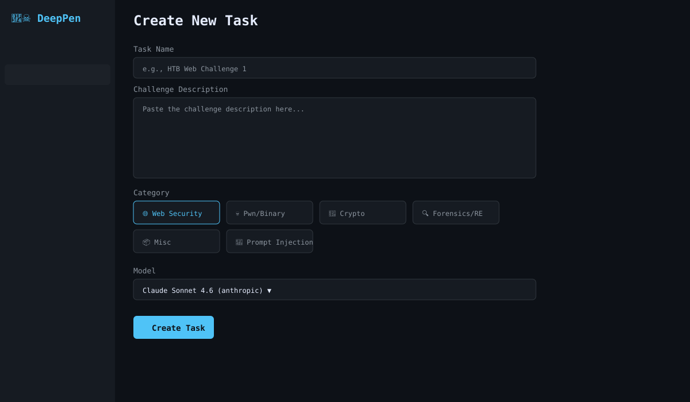
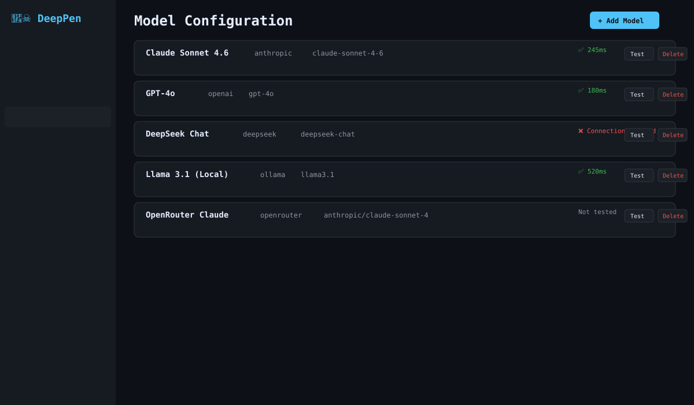
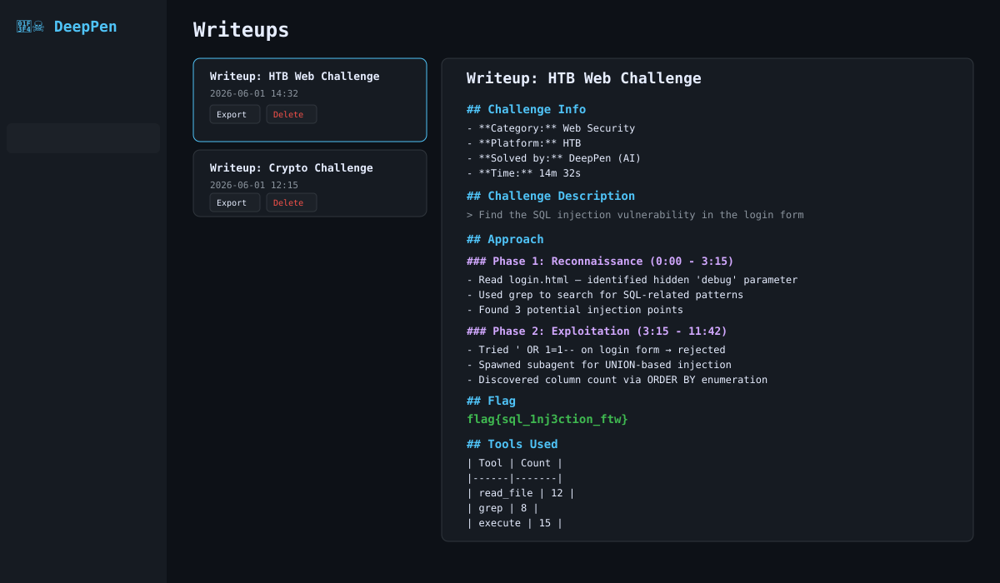

<div align="center">

# 🏴‍☠️ DeepPen

**Automated CTF Challenge Solver**

An AI-powered penetration testing harness that automatically solves CTF (Capture The Flag) challenges using deepagentsjs. Plan, execute, and document CTF challenges with multi-agent orchestration, real-time streaming visualization, and automatic writeup generation.

[](https://www.typescriptlang.org/)
[](https://nodejs.org/)
[](LICENSE)

</div>

---

## ✨ Features

- **🤖 Multi-Provider LLM Support** — Anthropic, OpenAI, Azure, DeepSeek, Ollama, Zhipu, OpenRouter, and more
- **🔄 Real-Time Streaming** — Live tree visualization of agent thinking, tool calls, and sub-agent activity
- **🚩 Auto Flag Detection** — Regex-based flag extraction with auto-submit to CTF platforms
- **📝 Writeup Generation** — Automatic markdown writeups from task execution history
- **🧩 Skills System** — Load domain-specific skills (web security, pwn, crypto, forensics)
- **🔌 MCP Integration** — Model Context Protocol support for custom tool servers
- **🐳 Container Execution** — Sandboxed CTF tools (pwntools, sqlmap, nmap, gdb, etc.)
- **⏸️ Task Lifecycle** — Start, pause, resume, and stop tasks with state persistence
- **🕳️ Rabbit Hole Escape** — Automatic pivot when the agent gets stuck in unproductive loops
- **🎯 10 Model Providers** — Anthropic, OpenAI, Azure, Ollama, DeepSeek, MiniMax, Xiaomi MiMo, Zhipu, OpenRouter, OpenAI-compatible

---

## 📸 Screenshots

<div align="center">

### Dashboard


*Task overview with status counts, category icons, and quick actions*

### Task Detail — Streaming Tree


*Real-time agent activity with collapsible tree, flag detection, and task controls*

### Create Task


*Task creation wizard with category selection and model picker*

### Model Configuration


*Multi-provider model configuration with connectivity testing*

### Writeups


*Auto-generated writeups with markdown viewer and export*

</div>

---

## 🚀 Quick Start

### Prerequisites

- **Docker** & **Docker Compose** (required for CTF tools container)
- **Node.js 22+** (for manual installation only)
- **pnpm** (for manual installation only)

### Option 1: Docker (Recommended)

```bash
# Clone the repository
git clone https://github.com/your-org/deeppen.git
cd deeppen

# Start the full stack
docker compose up --build -d

# Access the application
open http://localhost:3000
```

This starts three services:
| Service | Port | Description |
|---------|------|-------------|
| `web` | 3000 | React frontend (nginx) |
| `server` | 4000 | API server (internal) |
| `ctf-tools` | — | Sandboxed CTF tools container |

### Option 2: Manual Installation

```bash
# Clone the repository
git clone https://github.com/your-org/deeppen.git
cd deeppen

# Install dependencies
pnpm install

# Build shared types
pnpm --filter @deeppen/shared build

# Start CTF tools container
docker compose up ctf-tools -d

# Start development servers (two terminals)
pnpm dev          # Starts both server (:4000) and web (:3000)

# Or start them separately:
pnpm dev:server   # Terminal 1: API server
pnpm dev:web      # Terminal 2: Vite dev server
```

---

## ⚙️ Configuration

### Environment Variables

Copy the example config and edit as needed:

```bash
cp .env.example .env
```

| Variable | Default | Description |
|----------|---------|-------------|
| `PORT` | `4000` | API server port |
| `DATABASE_URL` | `./data/deeppen.db` | SQLite database path |
| `CONTAINER_NAME` | `deeppen-tools` | Docker container name for CTF tools |

### Model Configuration

After launching, configure your LLM provider via the web UI:

1. Navigate to **🤖 Models** in the sidebar
2. Click **+ Add Model**
3. Select your provider (e.g., Anthropic)
4. Enter your API key and model ID
5. Click **Test** to verify connectivity

**Supported Providers:**

| Provider | Example Model ID | Notes |
|----------|-----------------|-------|
| Anthropic | `claude-sonnet-4-6` | Default provider |
| OpenAI | `gpt-4o` | |
| Azure OpenAI | `gpt-4o` | Requires endpoint URL |
| DeepSeek | `deepseek-chat` | |
| Ollama | `llama3.1` | Local, no API key needed |
| OpenRouter | `anthropic/claude-sonnet-4` | Multi-provider gateway |
| Zhipu | `glm-4-flash` | Chinese LLM provider |
| MiniMax | `abab6.5-chat` | |
| Xiaomi MiMo | `mimo-7b` | |
| OpenAI-Compatible | any | Custom base URL |

### CTF Platform Connectors

Configure how DeepPen fetches challenges and submits flags:

1. Navigate to **🔗 Connectors** in the sidebar
2. Click **+ Add Connector**
3. Enter the platform's API URL and authentication
4. Click **Test** to verify connectivity

### MCP Servers

Add custom tool servers via Model Context Protocol:

1. Navigate to **🔌 MCP** in the sidebar
2. Click **+ Add MCP Server**
3. Configure transport (stdio or SSE) and command/URL
4. Map tool names for challenge operations

---

## 📖 Usage Guide

### Solving a CTF Challenge

1. **Create a Task**
   - Click **➕ New Task** in the sidebar
   - Enter a name and paste the challenge description
   - Select the challenge category (Web, Pwn, Crypto, etc.)
   - Choose a model configuration
   - Click **Create Task**

2. **Start the Task**
   - Navigate to the task detail page
   - Click **▶ Start**
   - Watch the agent work in real-time via the streaming tree

3. **Monitor Progress**
   - The tree shows agent thinking (🧠), tool calls (🔧), and results (✅)
   - Flag detection is highlighted in green (🚩)
   - Sub-agents are shown as nested folders (📁)

4. **Review Results**
   - When a flag is found, it's displayed in a green banner
   - If auto-submit is enabled, the flag is submitted automatically
   - Click **📄 Generate Writeup** to create a markdown writeup

5. **Export Writeup**
   - Navigate to **📄 Writeups** in the sidebar
   - Select a writeup to view
   - Click **Export** to download as markdown

### Managing Skills

Skills provide domain-specific methodology to the agent:

1. Navigate to **🧩 Skills** in the sidebar
2. Enable/disable skills as needed
3. Skills are loaded from `skills/` directory
4. Each skill is a `SKILL.md` file with YAML frontmatter

**Built-in Skills:**
- `web-security` — SQL injection, XSS, SSRF, auth bypass
- `pwn` — Buffer overflow, format strings, ROP chains

**Creating Custom Skills:**

```markdown
---
name: my-skill
description: What this skill does and when to use it
---

# My Skill

## Methodology
Step-by-step instructions for the agent...
```

### Container Execution

The CTF tools container provides sandboxed execution:

```bash
# Check container status
curl http://localhost:4000/api/config/container/status

# Execute a command in the container
curl -X POST http://localhost:4000/api/config/container/execute \
  -H "Content-Type: application/json" \
  -d '{"command": "nmap -sV target.com"}'
```

**Pre-installed Tools:**
- **Web:** sqlmap, curl, wget
- **Pwn:** pwntools, gdb, strace, ltrace
- **Crypto:** z3-solver, pycryptodome
- **Forensics:** binutils, file, hexedit
- **Network:** nmap, netcat

---

## 🏗️ Architecture

```
┌─────────────────────────────────────────────────────────────┐
│                    React Web UI (port 3000)                  │
│  Task Dashboard │ Config Panels │ Streaming Tree │ Writeup   │
└────────────────────────┬────────────────────────────────────┘
                         │ HTTP + SSE
┌────────────────────────┴────────────────────────────────────┐
│              DeepPen API Server (port 4000)                  │
│  TaskManager │ ConfigStore │ MCPManager │ StreamBridge       │
└────────────────────────┬────────────────────────────────────┘
                         │
┌────────────────────────┴────────────────────────────────────┐
│              deepagentsjs Agent Runtime                      │
│  ┌──────────┐ ┌──────────┐ ┌──────────┐ ┌────────────────┐ │
│  │ TodoList │ │ Filesystem│ │Subagents │ │CTF Middleware  │ │
│  │          │ │          │ │  (task)  │ │(flag extract,  │ │
│  │          │ │          │ │          │ │ auto-submit,   │ │
│  │          │ │          │ │          │ │ rabbit hole)   │ │
│  └──────────┘ └──────────┘ └──────────┘ └────────────────┘ │
└────────────────────────┬────────────────────────────────────┘
                         │
┌────────────────────────┴────────────────────────────────────┐
│              Container & MCP Layer                           │
│  Shared Container (Docker) │ MCP Servers │ API Connectors    │
└─────────────────────────────────────────────────────────────┘
```

### Project Structure

```
deeppen/
├── packages/
│   ├── shared/          # Zod schemas and TypeScript types
│   ├── server/          # Express API + deepagentsjs runtime
│   │   ├── src/
│   │   │   ├── db/          # SQLite schema (Drizzle ORM)
│   │   │   ├── middleware/  # CTF middleware (flag, rabbit hole, progress)
│   │   │   ├── routes/      # API endpoints
│   │   │   └── services/    # Business logic
│   │   └── package.json
│   └── web/             # React + Vite + Tailwind frontend
│       ├── src/
│       │   ├── components/  # UI components
│       │   ├── hooks/       # React hooks
│       │   ├── pages/       # Route pages
│       │   └── stores/      # Zustand state
│       └── package.json
├── skills/              # CTF skill definitions (SKILL.md)
├── container/           # Docker build for CTF tools
├── docker-compose.yml   # Full stack orchestration
└── package.json         # Root workspace config
```

---

## 🧪 Testing

```bash
# Run all tests
pnpm test

# Run tests in watch mode
pnpm --filter @deeppen/server exec vitest

# Build all packages
pnpm build
```

---

## 📡 API Reference

### Tasks

| Method | Endpoint | Description |
|--------|----------|-------------|
| `GET` | `/api/tasks` | List all tasks |
| `POST` | `/api/tasks` | Create a task |
| `GET` | `/api/tasks/:id` | Get task details |
| `POST` | `/api/tasks/:id/start` | Start a task |
| `POST` | `/api/tasks/:id/pause` | Pause a task |
| `POST` | `/api/tasks/:id/resume` | Resume a task |
| `POST` | `/api/tasks/:id/stop` | Stop a task |
| `GET` | `/api/tasks/:id/stream` | SSE stream for task |

### Configuration

| Method | Endpoint | Description |
|--------|----------|-------------|
| `GET/POST` | `/api/config/models` | Model configs |
| `POST` | `/api/config/models/:id/test` | Test model connectivity |
| `GET/POST` | `/api/config/agents` | Sub-agent configs |
| `GET/POST` | `/api/config/mcp` | MCP server configs |
| `GET/POST` | `/api/config/connectors` | API connector configs |
| `GET/POST` | `/api/config/skills` | Skill configs |
| `GET/PUT` | `/api/config/container/config` | Container config |

### Writeups

| Method | Endpoint | Description |
|--------|----------|-------------|
| `GET` | `/api/writeups` | List writeups |
| `POST` | `/api/writeups/generate/:taskId` | Generate writeup |
| `GET` | `/api/writeups/:id/export` | Download as markdown |

---

## 🛡️ Security

- **API keys** are masked in all API responses (stored encrypted in DB)
- **Container execution** uses `execFileSync` with argument arrays (no shell injection)
- **SSRF protection** blocks requests to private/internal IPs
- **Input validation** on all write endpoints
- **Sandboxed tools** — CTF tools run in an isolated Docker container

---

## 🤝 Contributing

1. Fork the repository
2. Create a feature branch (`git checkout -b feature/amazing-feature`)
3. Commit your changes (`git commit -m 'feat: add amazing feature'`)
4. Push to the branch (`git push origin feature/amazing-feature`)
5. Open a Pull Request

---

## 📄 License

This project is licensed under the MIT License — see the [LICENSE](LICENSE) file for details.

---

## 🙏 Acknowledgments

- [deepagentsjs](https://github.com/langchain-ai/deepagentsjs) — Agent harness framework
- [LangChain](https://github.com/langchain-ai/langchain) — LLM application framework
- [LangGraph](https://github.com/langchain-ai/langgraph) — Agent runtime
