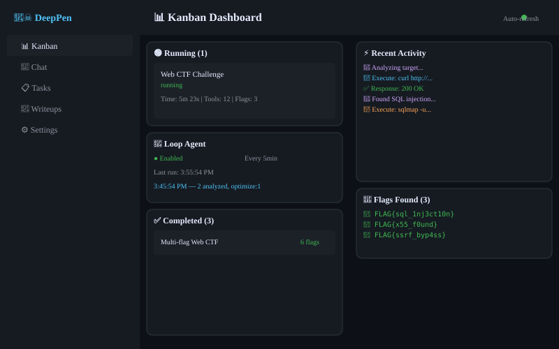
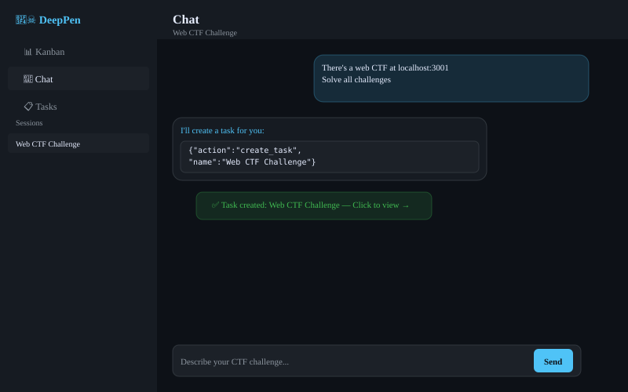
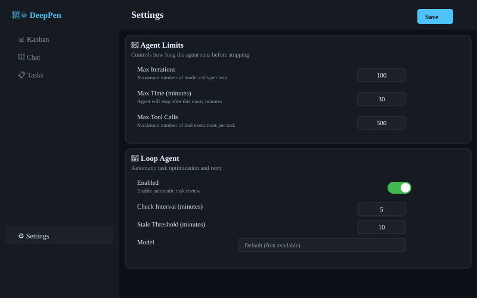

<div align="center">

# 🏴‍☠️ DeepPen

**Automated CTF Challenge Solver**

An AI-powered penetration testing harness that automatically solves CTF (Capture The Flag) challenges using DeepAgents. Plan, execute, and document CTF challenges with multi-agent orchestration, real-time streaming visualization, and automatic writeup generation.

[](https://www.typescriptlang.org/)
[](https://nodejs.org/)
[](LICENSE)

</div>

---

## ✨ Features

- **🤖 Multi-Provider LLM Support** — Anthropic, OpenAI, Azure, DeepSeek, Ollama, Zhipu, OpenRouter, and more
- **💬 Chat-to-Task** — Describe a challenge in natural language, auto-create tasks
- **📊 Kanban Dashboard** — Real-time task progress with activity feed and flag tracking
- **🔄 Real-Time Streaming** — Live tree visualization of agent thinking, tool calls, and results
- **🚩 Multi-Flag Support** — Handles CTF platforms with multiple challenges
- **🔄 Loop Agent** — Automatic task optimization, retry, and prompt injection when stuck
- **🧩 Skills System** — 50+ security skills (SQL injection, XSS, SSRF, RCE, etc.)
- **🔌 MCP Integration** — Model Context Protocol support for custom tool servers
- **🐳 Container Execution** — Sandboxed CTF tools (nmap, sqlmap, curl, python, etc.)
- **📝 Writeup Generation** — Automatic markdown writeups from task execution history
- **⚙️ Settings** — Configurable agent limits, Loop Agent, and UI preferences
- **⏸️ Task Lifecycle** — Start, pause, resume, stop, and retry tasks
- **🕳️ Rabbit Hole Escape** — Automatic pivot when the agent gets stuck

---

## 📸 Screenshots

<div align="center">

### Kanban Dashboard


*Real-time task progress with activity feed, flags, and Loop Agent status*

### Chat


*Describe challenges in natural language, auto-create tasks*

### Task Detail — Streaming Tree


*Real-time agent activity with expandable tree, tool calls, and results*

### Settings


*Configure agent limits, Loop Agent, and UI preferences*

</div>

---

## 🚀 Quick Start

### Prerequisites

- **Docker** & **Docker Compose** (for CTF tools container)
- **Node.js 22+** (for manual installation)
- **pnpm** (for manual installation)

### Option 1: Docker (Recommended)

```bash
# Clone the repository
git clone https://github.com/wolf0x/deeppen.git
cd deeppen

# Start the full stack
docker compose up --build -d

# Access the application
open http://localhost:3000
```

### Option 2: Manual Installation

```bash
# Clone the repository
git clone https://github.com/wolf0x/deeppen.git
cd deeppen

# Install dependencies
pnpm install

# Build shared types
pnpm --filter @deeppen/shared build

# Start CTF tools container
docker compose up ctf-tools -d

# Start development servers
pnpm dev
```

---

## ⚙️ Configuration

### Model Configuration

1. Navigate to **🤖 Models** in the sidebar
2. Click **+ Add Model**
3. Select your provider and enter API key
4. Click **Test** to verify connectivity

### Settings

Navigate to **⚙️ Settings** to configure:

| Setting | Default | Description |
|---------|---------|-------------|
| Max Iterations | 100 | Maximum model calls per task |
| Max Time | 30 min | Agent stops after this duration |
| Max Tool Calls | 500 | Total tool executions per task |
| Loop Agent | Disabled | Auto-retry and optimize failed tasks |
| Loop Interval | 5 min | How often to check for stuck tasks |

---

## 📖 Usage

### Chat to Create Tasks

1. Navigate to **💬 Chat**
2. Describe the challenge: *"There's a web CTF at http://target.com"*
3. DeepPen auto-creates a task with the right category

### Monitor Progress

- **📊 Kanban** — Real-time overview of all tasks
- **Task Detail** — Expandable stream tree showing every tool call and result
- **Flags** — Highlighted in green, auto-detected from tool output

### Loop Agent

When enabled, the Loop Agent:
- Checks for stuck/failed tasks every N minutes
- Analyzes what went wrong (timeout, loop, wrong approach)
- Injects optimized prompts to guide the agent
- Retries with improved context

### Skills

50+ security skills are pre-installed:
- **Web**: SQL injection, XSS, SSRF, IDOR, CSRF, auth bypass, RCE
- **Pwn**: Buffer overflow, format strings, ROP chains
- **Crypto**: Classical ciphers, RSA, AES
- **Forensics**: File analysis, memory forensics
- **Misc**: OSINT, bug bounty methodology

---

## 🏗️ Architecture

```
┌─────────────────────────────────────────────┐
│           React Frontend (port 3000)         │
│  Kanban │ Chat │ Tasks │ Settings │ Writeups │
└─────────────────────┬───────────────────────┘
                      │ HTTP + SSE
┌─────────────────────┴───────────────────────┐
│           API Server (port 4000)             │
│  TaskManager │ ChatService │ LoopAgent       │
│  ConfigStore │ StreamBridge │ WriteupGen     │
└─────────────────────┬───────────────────────┘
                      │
┌─────────────────────┴───────────────────────┐
│           DeepAgents Runtime                 │
│  Agent Loop │ Middleware │ Skills │ Tools    │
└─────────────────────┬───────────────────────┘
                      │
┌─────────────────────┴───────────────────────┐
│           Container & MCP Layer              │
│  Docker (nmap, sqlmap, curl) │ MCP Servers  │
└─────────────────────────────────────────────┘
```

---

## 🧪 Testing

```bash
pnpm test
pnpm build
```

---

## 📡 API Reference

| Method | Endpoint | Description |
|--------|----------|-------------|
| `GET` | `/api/tasks` | List tasks |
| `POST` | `/api/tasks` | Create task |
| `POST` | `/api/tasks/:id/start` | Start task |
| `POST` | `/api/tasks/:id/retry` | Retry failed task |
| `GET` | `/api/loop/status` | Loop Agent status |
| `GET/PUT` | `/api/settings` | Settings |
| `GET` | `/api/writeups` | List writeups |

---

## 🤝 Contributing

1. Fork the repository
2. Create a feature branch
3. Commit your changes
4. Push and open a Pull Request

---

## 📄 License

MIT License — see [LICENSE](LICENSE)

---

## 🙏 Acknowledgments

- [DeepAgents](https://github.com/anthropics/deepagents) — Agent framework
- [LangChain](https://github.com/langchain-ai/langchain) — LLM framework
- [Claude-BugHunter](https://github.com/elementalsouls/Claude-BugHunter) — Security skills
